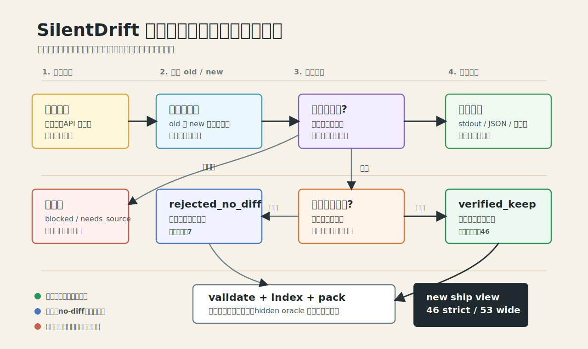

# SilentDrift Benchmark

SilentDrift is a case discovery and reproduction library for silent behavioral
drift: old and new versions both run successfully, but observable behavior
changes in a way that can silently affect callers.

This repository is the artifact factory for the benchmark. It turns leads into
reproducible, reviewable, and packageable case-bank entries.

For a plain Chinese directory map, see `duwocn.md`. For the canonical case-bank
contract, see `docs/case-bank/README.md`.

## Version 1.2 Handoff (2026-05-24)

The strict offline benchmark target is met, and the repository now has two
offline packaging paths: the clean downstream bundle and a scorer-ready
SilentDriftBench eval pack. The 1.2 eval pack uses the downstream split schema,
records its public-field allowlist, and derives probe outputs from existing
verification artifacts where they are already available.

| Status | Count | Meaning |
| --- | ---: | --- |
| `verified_keep` | 101 | positive silent-drift cases; old/new both run and behavior changes |
| `rejected_cluster_duplicate` | 38 | clean drift repros rejected to avoid over-weighting one source cluster |
| `rejected_no_diff` | 7 | old/new both run but no useful behavior diff |
| `blocked_runtime` | 15 | local runtime missing or unsuitable |
| `blocked_dependency` | 27 | dependency install or resolution blocked |
| `needs_source` | 8 | needs better source evidence before promotion |

Total case-bank packages: 196.

```text
target verified_keep: 100
current verified_keep: 101
release status: 1.2 ready
```

The original 46 already-approved `verified_keep` cases remain counted and were
not rerun during the final expansion. They were only read by validation,
indexing, packaging, and tests.

The final expansion deliberately stops just above the 100-package target. Extra
clean data-table candidates, including many `holidays` rows, are preserved as
rejected or low-priority audit material instead of being used to inflate the
keep count.

## Deliverables

- Offline source of truth: `docs/case-bank/cases/`.
- Offline downstream package: generated with `python -m case_bank pack`; every
  `hidden/` directory is stripped from the public package.
- Optional scorer-ready eval pack: generated with `python -m case_bank eval-pack`.
  This derives `public/` plus `grader/hidden/` from the source case bank without
  changing the original case semantics.
- Online downstream library: `online/`, kept separate because those cases depend
  on live vendor platforms, credentials, account policy, hosted callbacks, or
  historical account state.
- Local 1.0 downstream bundle: `silentdrift-1.0-downstream.zip` at repository
  root after the release packaging step. It contains `offline/`, `online/`, and
  a release manifest.
- Local 1.2 eval pack: `chanwu_eval_pack/` at repository root after running the
  eval-pack packaging step. It currently includes best-effort `probe_outputs`
  for cases backed by existing run artifacts and declares `A0_no_context` /
  docs-corpus fallback policy in `manifest.json`.
- Local 1.2 downstream bundle: `silentdrift-1.2-downstream.zip` at repository
  root after the release packaging step. It contains the self-contained
  scorer-ready `chanwu_eval_pack/` directory.

## Verification Commands

Use this command shape from the repository root:

```powershell
$env:PYTHONPATH='silent_drift_miner\src'
python -m case_bank validate --cases docs\case-bank\cases
python -m case_bank index build --out docs\case-bank\indexes
python -m case_bank pack --src docs\case-bank\cases --out $env:TEMP\bench2_eval_package
python -m case_bank eval-pack --src docs\case-bank\cases --out chanwu_eval_pack
Compress-Archive -Path chanwu_eval_pack -DestinationPath silentdrift-1.2-downstream.zip -Force
python -m pytest silent_drift_miner\tests -q -p no:cacheprovider
```

Last full verification for 1.2:

```text
case_bank validate: OK 196 case-bank packages validated
case_bank index build: OK
case_bank pack: OK
pack hidden leak check: hidden_leak_count=0
eval-pack leak scan: pass, finding_count=0
eval-pack probe outputs: 67/101 cases
pytest: 132 passed, 1 skipped
```

## Important Paths

- `docs/case-bank/` - canonical case-bank layout, ledgers, indexes, and
  packaging prompts.
- `docs/case-bank/cases/` - complete offline benchmark source packages.
- `docs/case-bank/indexes/` - generated views over `metadata.json`.
- `docs/case-bank/migration-30-50-ledger.md` - sequential 30 and reverse 50
  migration ledger.
- `docs/case-bank/old-15-replay-ledger.md` - OLD15 replay ledger.
- `docs/case-bank-restructure/final-plan.md` - schema, folder contract, status
  meanings, and packaging rules.
- `docs/verification-runs/` - human-readable run notes for earlier verification
  passes.
- `data/verification/` - local raw replay evidence and run artifacts.
- `online/` - online-only platform/API drift records.
- `silent_drift_miner/` - miner, reproduction, oracle, audit, and adapter code.

## Case Lifecycle



A package is directly shippable only when both versions execute successfully and
the observed behavior changes.

## What Counts As Complete

A complete case-bank entry lives at:

```text
docs/case-bank/cases/<primary-scenario>/<case-id-slug>/
```

and contains:

```text
case.md
evidence.md
env.md
metadata.json
client/
hidden/
```

Only `verified_keep` entries should have `hidden/`. Rejected, blocked, and
source-needed records should keep public audit files but no hidden oracle.

## Packaging Policy

- Do not claim a case is complete unless the folder exists, metadata validates,
  indexes regenerate, and packaging succeeds with it included.
- Do not put raw dependency caches, virtual environments, `node_modules`,
  `vendor`, `bin`, `obj`, jars, or generated build products into case folders.
- Public task files must not reveal hidden oracle conditions or exact expected
  outputs.
- Keep blocked and rejected records when they preserve audit evidence, but do
  not count them as positive shippable silent-drift cases.
- Work with existing user or agent changes; do not revert unrelated edits.

## Local Cleanup Notes

The following are local/generated and should not be part of the shipped source
case bank unless there is a specific reason:

- `eval_package*/`
- `.uv-python/`
- `.uv-cache/`
- release zip bundles such as `silentdrift-*-downstream.zip`
- `data/verification/**` raw replay workspaces
- Python, Node, Go, .NET, JVM, Ruby, or PHP dependency caches

## Historical Docs

The phase docs still describe how the project got here. Treat them as
historical context when they conflict with the current case-bank contract:

- `docs/phase-0-ground-rules.md`
- `docs/phase-1-pipeline-skeleton.md`
- `docs/phase-2-python-reproduction.md`
- `docs/phase-3-oracle-package-audit.md`
- `docs/phase-4-real-python-cases.md`
- `docs/phase-5-llm-client-generation.md`
- `docs/phase-6-ecosystem-expansion.md`
